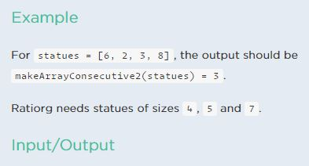

<b>C# Sharp programming exercises, practice, solution</b>

  <b>Exercises 1</b> 
  You are given an n x n 2D matrix that represents an image.  Rotate the image by 90 degrees (clockwise).

  

  <b>Exercises 2</b> 
 
   Ratiorg got statues of different sizes as a present from CodeMaster for his  
   birthday, each statue having an non-negative integer size.   Since he likes 
   to make things perfect, he wants to arrange them from smallest to largest so 
   that each statue will be bigger than the   previous one exactly by 1. He may  
   need some additional statues to be able to accomplish that.Help him figure out 
   the minimum number of additional statues needed.
   
   

